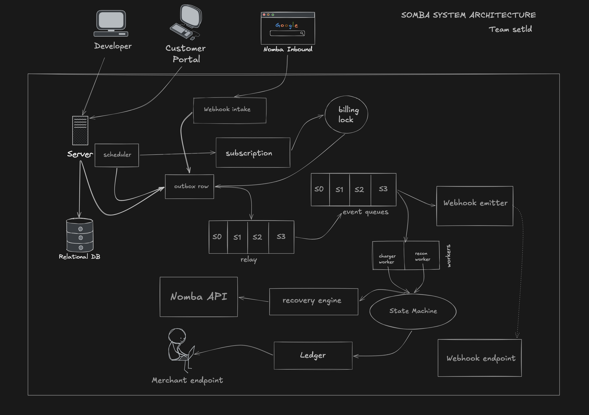

# Somba

Somba is recurring-billing and recovery infrastructure built on top of Nomba's payment rails.

It is meant for businesses and prt teams that want to offer subscriptions, retries, proration, recovery, customer self-service, and reconciliation without building the whole billing system themselves.

The short version: Somba is Stripe Billing for Nomba, with recovery logic designed for Nigerian payment behavior.

## Why it exists

Recurring billing is easy to describe and hard to run well. Real-world payments fail for different reasons, some of which are temporary and some of which need a different recovery path entirely.

Somba is designed to keep subscriptions alive when possible, avoid double charges, and make every naira traceable.

## Start here

- Read the product requirements in [PRD.md](./PRD.md)
- Read the product overview in [docs/overview.md](./docs/overview.md)
- Read the architecture guide in [docs/architecture.md](./docs/architecture.md)
- Read the subscription lifecycle in [docs/state-machine.md](./docs/state-machine.md)
- Read the recovery logic in [docs/recovery-engine.md](./docs/recovery-engine.md)

## Architecture image

It shows the entry points, the outbox, relay shards, event queues, workers, the state machine, the ledger, and the merchant/Nomba touchpoints.

## Documentation index

- [Overview](./docs/overview.md)
- [Architecture](./docs/architecture.md)
- [Deployment](./docs/deployment.md)
- [State Machine](./docs/state-machine.md)
- [Recovery Engine](./docs/recovery-engine.md)
- [Reconciliation](./docs/reconciliation.md)
- [API Reference](./docs/api-reference.md)
- [Data Model](./docs/data-model.md)
- [Proration](./docs/proration.md)
- [NFRs](./docs/nfrs.md)
- [Getting Started](./docs/getting-started.md)

## What is in this repo

- [PRD.md](./PRD.md) describes the product in plain English
- [docs/](./docs/) contains the supporting documentation pages
- [somba/](./somba/) is the FastAPI application: API routers, background workers (charge, recovery, reconciliation sweep, verify pass), the Nomba client, and the Alembic migrations
- [tests/](./tests/) is the real test suite (unit + integration)
- [scripts/](./scripts/) contains developer helper scripts (topic setup, demo seeding)
- [frontend/](./frontend/) is the React + Vite docs site and landing page — includes the interactive API docs, a dashboard (email/password auth, named API keys), and a sandbox page for testing the Nomba integration without touching live credentials

## Status

Somba is implemented and running. The API is live at `https://somba-jade.vercel.app`, backed by Postgres and a Redpanda-based outbox relay, with a full test suite (unit + integration) passing in CI. The docs above describe the design; the code is the current source of truth for exact request/response shapes.

> Somba by Team setld
